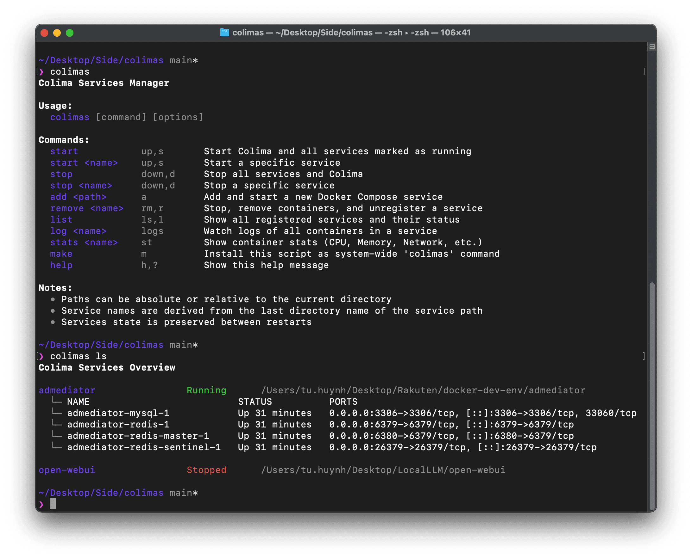

# Colimas - Colima Services Manager

[](https://opensource.org/licenses/MIT)

Colimas is a simple service management and visualization tool for Docker Compose projects running on Colima. It provides an intuitive interface to monitor, manage, and maintain your services across multiple projects, offering enhanced visibility and control over your multiple Docker Compose services.



## Features

- Automatic service restoration after Colima restart
- Service state persistence
- Simple service management with intuitive commands
- Service discovery and health monitoring
- Real-time container resource monitoring (CPU, Memory, Network I/O)

## Why Colimas?

While Docker Compose's restart policies (`always` or `unless-stopped`) can maintain container states across Colima restarts, Colimas enhances your service management experience by providing:

- A dynamic visualization tool (`colimas ls`) for monitoring service states
- Centralized management of multiple Docker Compose projects
- Simple, intuitive commands for service operations
- Service health monitoring and status tracking
- Easy service discovery across different projects

One of the key limitations of Docker Compose is that it doesn't provide a direct command to list all running or stopped services across multiple projects without specifying a particular project context or Compose file. Colimas solves this by providing a unified view and management interface for all your services, similar to how Docker Swarm's service management works, but for your local Docker Compose projects.

Perfect for developers who want better visibility and simplified management of their Docker Compose services across multiple projects.

## Prerequisites

- [Colima](https://github.com/abiosoft/colima)
- Docker and Docker Compose CLI
- macOS environment

## Installation

```bash
git clone https://github.com/tuhuynh27/colimas.git
chmod +x colimas.sh
./colimas.sh make
```

## Usage

### Basic Commands
```bash
colimas             # Start Colima and restore services
colimas start       # Same as above
colimas stop        # Stop all services and Colima
colimas list        # Show services status
```

### Service Management
```bash
colimas add ./path/to/service     # Add service
colimas start service-name        # Start specific service
colimas stop service-name         # Stop specific service
colimas remove service-name       # Remove service
colimas log service-name         # Watch logs of service containers
colimas stats service-name       # Monitor container resource usage
```

### Command Aliases
- `start, up, s` - Start services
- `stop, down, d` - Stop services
- `add, a` - Add service
- `remove, rm, r` - Remove service
- `list, ls, l` - List services
- `log, logs` - Watch service logs
- `stats, st` - Monitor container stats
- `help, h, ?` - Show help

## License

[MIT License](LICENSE)
